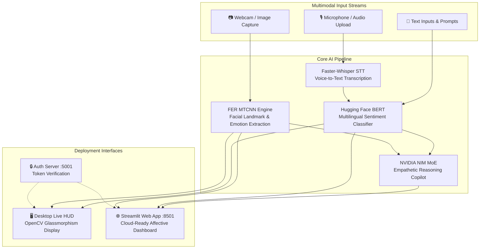

# 🌌 S.A.R.A. — Sentiment Analysis & Response AI

<div align="center">

[](LICENSE)
[](https://www.python.org/)
[](Dockerfile)
[](https://streamlit.io)
[](https://huggingface.co/nlptown/bert-base-multilingual-uncased-sentiment)
[](https://github.com/SYSTRAN/faster-whisper)

**Next-Generation Multimodal Emotion Recognition, Vocal Acoustics, and Affective AI Reasoning.**

[Key Features](#-key-features) • [Architecture](#-system-architecture) • [Quick Start](#-quick-start) • [Deployment](#-deployment-options) • [Docker](#-docker-deployment) • [API & Auth](#-authentication--security)

</div>

---

## 📖 Overview

**S.A.R.A.** (*Sentiment Analysis & Response AI*) is an enterprise-grade multimodal artificial intelligence platform that synchronizes **facial expression emotion detection**, **acoustic speech-to-text sentiment classification**, and **conversational cognitive reasoning**.

Whether deployed locally as a low-latency cyberpunk camera HUD or in the cloud as an interactive Streamlit web dashboard, S.A.R.A. delivers real-time affective computing insights.

---

## ✨ Key Features

- 👁️ **Real-Time Facial Emotion Detection**: Uses MTCNN and deep convolutional networks (`FER`) to analyze micro-expressions across 7 primary emotions (*Happy, Sad, Angry, Fear, Surprise, Neutral, Disgust*).
- 🎙️ **Acoustic Speech Transcription**: Fast local multilingual voice transcription powered by `faster-whisper` (CTranslate2 INT8 quantization).
- 📝 **Multilingual Sentiment Classification**: Analyzes conversational nuance and star ratings (1 to 5 stars) using fine-tuned multilingual BERT (`nlptown/bert-base-multilingual-uncased-sentiment`).
- 🧠 **Empathetic Cognitive Reasoning**: Integrated with NVIDIA NIM API (`nemotron-3-nano-30b-a3b`) to synthesize human-centered empathetic responses.
- 🎨 **Cosmic Cyberpunk HUD & Web Portal**: 
  - **Desktop HUD**: Real-time glassmorphism overlays, corner targeting brackets, and pulsating audio visualizer directly rendered on OpenCV webcam feeds.
  - **Web Portal**: Modern Streamlit cloud-deployable interface with real-time charting and file upload support.
- 🔐 **Zero-Trust Local Auth Server**: Built-in HTTP portal on port `5001` with SHA-256 password hashing and 8-hour timed session tokens (`.sara_token`).
- 🐳 **Production Containerization**: Fully dockerized with multi-service `docker-compose.yml`, health checks, and shared model cache volumes.

---

## 🏗️ System Architecture



---

## 📁 Repository Structure

```
SENTIMENT-ANALYSIS-SYSTEM/
├── .github/
│   └── workflows/
│       └── ci.yml               # Automated CI syntax & Docker build workflow
├── .env.example                 # Configuration template for API keys & ports
├── .gitattributes               # Git line-ending normalization
├── .gitignore                   # Ignore rules for venv, cache, and tokens
├── app.py                       # Cloud-deployable Streamlit Web Portal
├── auth_server.py               # Standalone Authentication HTTP Server (:5001)
├── config.py                    # NVIDIA NIM MoE configuration loader
├── docker-compose.yml           # Multi-container orchestration config
├── Dockerfile                   # Production-ready Python 3.10 Linux image
├── LICENSE                      # MIT License
├── main.py                      # Desktop Live HUD (OpenCV webcam + spacebar mic)
├── README.md                    # System documentation
├── requirements.txt             # Project dependencies
├── start.bat                    # 1-Click launcher for Windows
└── start.sh                     # 1-Click launcher for Linux / macOS
```

---

## 🚀 Quick Start

### 1. Prerequisites
- **Python**: `3.10` or `3.11` recommended.
- **FFmpeg**: Required for audio transcoding.
  - Windows: `winget install Gyan.FFmpeg` or `choco install ffmpeg`
  - Linux: `sudo apt install ffmpeg portaudio19-dev`
  - macOS: `brew install ffmpeg portaudio`

### 2. Installation

Clone the repository and install dependencies:

```bash
git clone https://github.com/Marin-Codes/SENTIMENT-ANALYSIS-SYSTEM.git
cd SENTIMENT-ANALYSIS-SYSTEM

# Create virtual environment
python -m venv .venv

# Activate virtual environment:
# Windows (PowerShell):
.venv\Scripts\Activate.ps1
# Linux / macOS:
source .venv/bin/activate

# Install dependencies
pip install --upgrade pip
pip install -r requirements.txt
```

### 3. Environment Setup

Copy `.env.example` to `.env` and insert your optional API keys:

```bash
cp .env.example .env
```

---

## 💻 Execution Modes

### Mode 1: Cloud & Web Portal (Streamlit) — *Recommended*
Provides an interactive web interface with no physical hardware requirements:

```bash
streamlit run app.py
```
*Access in browser at:* `http://localhost:8501`

### Mode 2: Desktop Live HUD (Webcam & Microphone)
Real-time augmented camera display with Spacebar voice capture:

1. **Launch Authentication Server:**
   ```bash
   python auth_server.py
   ```
2. Open `http://localhost:5001` in your browser and log in with demo credentials.
3. **Launch Desktop Live HUD:**
   ```bash
   python main.py
   ```
   - Look at the camera for real-time facial expression tracking.
   - **HOLD SPACEBAR** to record voice. Release spacebar to transcribe and analyze.
   - Press **ESC** to exit.

### Mode 3: 1-Click Launchers
- **Windows**: Double-click `start.bat`
- **Linux/macOS**: Run `./start.sh`

---

## 🐳 Docker Deployment

Run S.A.R.A. in an isolated containerized environment:

### Single Command with Docker Compose
```bash
docker compose up --build
```

- **Web Dashboard**: `http://localhost:8501`
- **Auth Server**: `http://localhost:5001`

### Standalone Docker Build & Run
```bash
docker build -t sara-ai .
docker run -p 8501:8501 sara-ai
```

---

## 🔐 Authentication & Security

The authentication server (`auth_server.py`) operates as a lightweight security barrier.

| Email | Password | Role |
| :--- | :--- | :--- |
| `admin@sara.ai` | `sara2024` | Administrator |
| `demo@sara.ai` | `demo1234` | Demo Tester |
| `user@sara.ai` | `password` | Standard User |

*Tokens are stored locally in `.sara_token` with an 8-hour expiration TTL.*

---

## ☁️ Cloud Deployment Platforms

### Streamlit Community Cloud
1. Fork or push this repository to GitHub.
2. Sign in to [share.streamlit.io](https://share.streamlit.io).
3. Select this repository and set `Main file path` to `app.py`.
4. Deploy!

### Hugging Face Spaces
1. Create a new Space with the **Streamlit** SDK.
2. Push the repository files to the Space.
3. Configure secret `NVIDIA_API_KEY_NEMOTRON_3_NANO_30B_A3B` under Space Settings.

---

## 📄 License

This project is open-source and distributed under the [MIT License](LICENSE).
Copyright (c) 2026 Deepanjali 🌼
